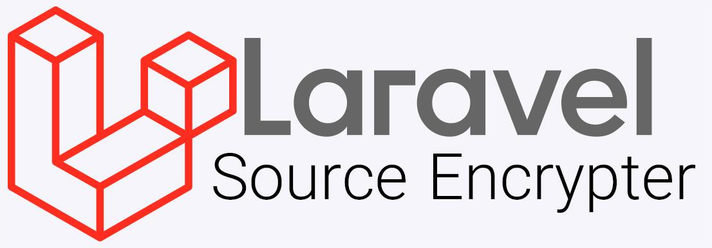

# Laravel Source Encrypter



This package encrypts your php code with [phpBolt](https://phpbolt.com) 

*For Laravel and Lumen 8*, 9*

* [Installation](#installation)
* [Usage](#usage)

## Installation

### Step 1
You have to [install phpBolt](https://phpbolt.com/download-phpbolt/).


### Step 2
Require the package with composer using the following command:
```bash
composer require thedeparted/laravel-source-encryption
```
### Step 3
#### For Laravel
The service provider will automatically get registered. Or you may manually add the service provider in your `config/app.php` file:
```php
'providers' => [
    // ...
    \thedeparted\LaravelSourceEncryption\SourceEncryptServiceProvider::class,
];
```

#### For Lumen
Add this line of code under the `Register Service Providers` section of your `bootstrap/app.php`:
```php
$app->register(\thedeparted\LaravelSourceEncryption\SourceEncryptServiceProvider::class);
```


### Step 4 (Optional)
You can publish the config file with this following command:
```bash
php artisan vendor:publish --provider="thedeparted\LaravelSourceEncryption\SourceEncryptServiceProvider" --tag=config
```
**Note:** If you are using Lumen, you have to use [this package](https://github.com/laravelista/lumen-vendor-publish).

## Usage
Open terminal in project root and run this command: 
```bash
php artisan encrypt-source
```
This command encrypts files and directories in `config/source-encryption.php` file. Default values are `app`, `database`, `routes`, `config`.

The default destination directory is `encrypted-source`. You can change it in `config/source-encryption.php` file.

Also the default encryption key length is `16`. You can change it in `config/source-encryption.php` file. `6` is the recommended key length.

This command has these optional options:

| Option      | Description                                                          | Example                 |
|-------------|----------------------------------------------------------------------|-------------------------|
| source      | Path(s) to encrypt                                                   | app,routes,public/a.php |
| destination | Destination directory                                                | encrypted-source               |
| key         | Custom Encryption key                                                |                        |
| keylength   | Encryption key length                                                | 16                       |
| force       | Force the operation to run when destination directory already exists |                         |

### Usage Examples

| Command                                                       | Description                                                                                                       |
|---------------------------------------------------------------|-------------------------------------------------------------------------------------------------------------------|
| `php artisan encrypt-source`                                  | Encrypts with default source, destination and keylength. If the destination directory exists, asks for delete it. |
| `php artisan encrypt-source --force`                          | Encrypts with default source, destination and keylength. If the destination directory exists, deletes it.         |
| `php artisan encrypt-source --source=app`                     | Encrypts `app` directory to the default destination with default keylength.                                       |
| `php artisan encrypt-source --destination=encrypted-source`               | Encrypts with default source and key length to `encrypted-source` directory.                                                  |
| `php artisan encrypt-source --destination=encrypted-source --keylength=8` | Encrypts default source to `encrypted-source` directory and the encryption key length is `8`.                                 |
| `php artisan encrypt-source --destination=encrypted-source --key="somecustomstrongstring"` | Encrypts default source to `encrypted-source` directory and the encryption key is `somecustomstrongstring` |               

Updated with ♥ by The Departed 

Support can be shared by staring this repository.